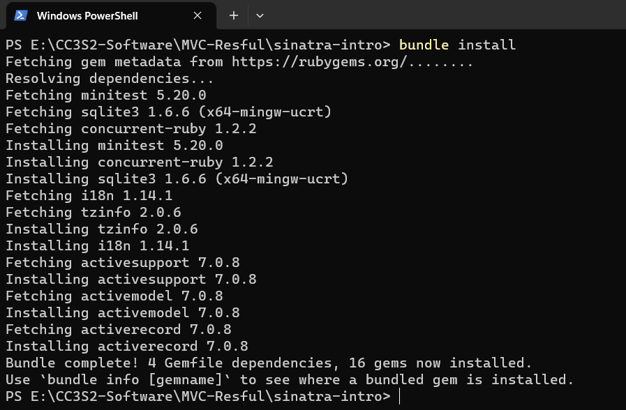
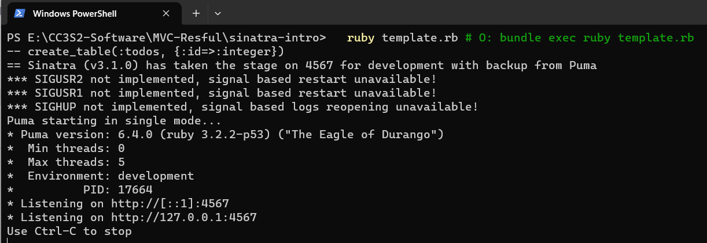
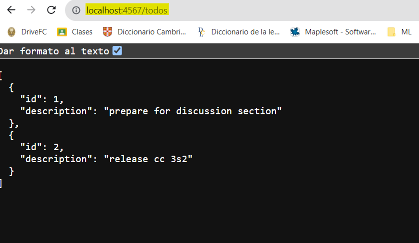

# Demostracion de MVC, rutas RESTful y CRUD con Sinatra

## Integrantes
`1. Espinoza Pari, Franklin`

`2. De la cruz Valdiviezo, Pedro Luis David`

`3. Azaña Vega, Luis Angel`

## Sinatra
Sinatra es un framework de aplicacion web escrito en Ruby. Es un ligero framework que permite a los desarrolladores 
crear rapidamente aplicaciones web y APIs. Ademas, sigue un enfoque minimalista, y provee un simple y elegante DSL
(Domain-Specific Language) para definir rutas y manejar solicitudes HTTP.

### Instalamos las dependencias
~~~
  cd sinatra-intro/
  bundle install
  ruby template.rb # O: bundle exec ruby template.rb
~~~

Pero esto botara el siguiente error de carga *(load error)*
~~~
-- create_table(:todos, {:id=>:integer})
C:/Ruby32-x64/lib/ruby/gems/3.2.0/gems/rack-2.2.8/lib/rack/handler.rb:45:in `pick': Couldn't find handler for: puma, falcon, thin, HTTP, webrick. (LoadError)
        from C:/Ruby32-x64/lib/ruby/gems/3.2.0/gems/sinatra-3.1.0/lib/sinatra/base.rb:1583:in `run!'
        from C:/Ruby32-x64/lib/ruby/gems/3.2.0/gems/sinatra-3.1.0/lib/sinatra/main.rb:47:in `block in <module:Sinatra>'
~~~
Enfoquemonos en lo siguiente

`Couldn't find handler for: puma, falcon, thin, HTTP, webrick. (LoadError)`

Este error nos da a entender que Sinatra no pudo encontrar un **web server** para poder ejecutar nuestra aplicacion.

Para solucionarlo, instalaremos el servidor **puma**. Para esto podemos agregar `gem 'puma'` en nuestro *gemfile* o
sino desde el terminal con el siguiente comando `gem install puma`.

Ahora podemos ejecutar el `template.rb`

~~~
ruby template.rb # O: bundle exec ruby template.rb
~~~

Se crea una tabla `todos_db`
Sinatra toma el puerto 4567 por defecto para el modo desarrollo.

Pegamos el siguiente URL en nuestro navegador favorito `http://localhost:4567/todos`.

Mientras que el servidor sigue conectado, podemos ejecutar el siguiente comando para verificar que la aplicacion
se esta ejecutando localmente y responde solicitudes. 

`curl http://localhost:4567/todos`

Este comando activa una solicitud `GET` para obtener la informacion de la pagina en nuestro `shell`.

Podemos ver que el contenido esta en formato `json`, debido a lo siguiente

~~~ruby
get '/todos' do
  content_type :json
  Todo.all.to_json
end
~~~

